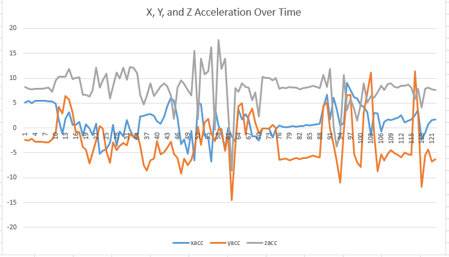

# Pi-In-The-Sky

## Table Of Contents
* [Planning](#Planning)
* [Documentation](#Documentation)

## Planning

### Final Function
The final function of our project will consist of a Pico suspended safely within a soccer ball that collects acceleration and rotation data while it’s being kicked around. The ball will be in two halves and lock into place to make retrieving and replacing the Pico easy. If we have extra time we’d like to model the path of our ball in a 3D space.

### Diagrams

### Materials
* PLA, Foam, Pico, Elastic Bands, Popped Soccer Ball, Pico Breadboard, and Accelerometer
* PLA: $6
* Pico and breadboard: $6
* Bands: $5
* Soccer ball: Bring from home
* Accelerometer: $25 assuming we might need 2 throughout the project

### What To Learn:
How to do Dead Reckoning, how to specifically lock the ball, how we seamlessly assemble the two balls, and how to prevent the ball from breaking after being kicked. 

### Definition of Success
We will be successful when we are able to report and graph the acceleration of the ball after it is kicked which will allow us to determine velocity and position of the ball too. We also require 100% survivability of the device so we won’t be successful unless the ball remains intact completely and the pico undamaged.

### Safety Concerns
* P: The ball shattering on impact and sending shrapnel everywhere.
* S: We make our ball strong enough to withstand a kick and we pad the PLA part so that it will remain contained if it breaks
* P: Someone getting hit with the ball and getting hurt
* S: We will not kick the ball toward any person unless passing in a very controlled manner with confirmation of active participation from all parties.
* P: Our Pico lighting on fire in our ball and creating a big blaze.
* S: We will do our best to mitigate fire concerns such as creating a fireproof prototype but we will also have potential fire protocols in place as reactive measures…worst case scenario we make smores.

### Schedule
* Jan Week 1: Create CAD prototype, start code and testing for accelerometer.  
* Jan Week 2: Edit CAD prototype, get all outside materials, finish basic accelerometer code.  
* Jan Week 3: Print and create physical prototype, use accelerometer to initiate dead reckoning.  
* Jan Week 4: Iterate physical prototype after it inevitably not working properly, continue dead reckoning testing.  
* Jan Week 5: Relatively finalize physical prototype, code dead reckoning to report results to driver.  
* Feb Week 1: One week of leeway for testing code and adjusting together.  
* Feb Week 2: Test code on physical prototype inside in ideal conditions gently.  
* Feb Week 3: Test code a little less gently and adjust code and iterate prototype.  
* Feb Week 4: Move outside to test and iterate.  
* Mar Week 1: Work on tweaking accuracy on dead reckoning and what it delivers to us.  
* Mar Week 2: Test and tweak.  
* Mar Week 3: Finalize ball and use for testing code.  
* Mar Week 4: Leeway for whatever needs done.  
* Apr Week 2, 3, and 4: Shoot the ball and track it.  
* May Week 1: Document successes/failures/project and use data to create a super cool training interface.  
* May Week 2: Document, work on data display.  
* May Week 3: Finish documentation and data display video.  
* May Week 4 & 5: Leeway time.  

### Code
We have anticipated some problems regarding the various forces acting on our soccer ball and how we will be able to successfully track its movement using just an accelerometer so the code will have to be a potentially dynamic plan but I will do my best to show the gist.

* #### Pseudo-Code
  Set up accelerometer
  Add up the net x translation changes accounting for any tipping or rotating
  Print total x value
  Add up the net y translation changes accounting for any tipping or rotating
  Print total y value
  Add up net z translation changes accounting for any tipping or rotating
  Print total z value
  Triangulate the values to map the position of the ball at time t
  Derive velocity at any given t from the position
  Derive acceleration at any given t from velocity
  Graph position, velocity, and acceleration of the ball throughout its travels
  ***IF WE HAVE TIME create a 3d representation of how the ball moved on a real field including bounces etc

## Documentation

### Materials Used
* Cheetah TPU
* Pico and Cowbell
* Accelerometer
* Pico Headers
* Foam Ball
* Glue
* #4-40 Screws
* Soldered Nut Inserts
* Switch
* 6x1 Header

### CAD Renderings
#### 1.0 (Threaded)

#### 2.0 (Screwed)

### CAD Process and Problems
* The CAD process was fairly standard for this assignment, despite a few road bumps. We began by simply making one hemisphere of our ball and started adding hooks to attach bungees to suspend the Pico. We quickly realized that bungees wouldn't keep the Pico rigid enough and would eventually mess with our Pico's data. So we pivoted to a much more basic, pole structure, meaning we just attached our Pico to some solid poles in the hemisphere. We then added a stand with a some concavity for our Pico to sit in so that it won't be able to wiggle around. We finished this half off by using a public threading tool to automatically add threading to the hemisphere so it can connect to its other half. Next we copied over the hemisphere to another part studio, minus the inner poles, and added reverse threading to it so the two halves fit together. 
* Going back to the half with the pico in it, we needed to add one more piece to secure our pico for consistent data. We opted to create a flexible clamp that would fit over the pico and hook under its stand. We decided to use flexible filament so that our design had some give and could fit more taught around the Pico. We finally added to two halves together in an assembly and admired it for many moons.
* After we had finished the brunt of the work, we realized a few touches needed to be added to better the design. We added holes that ran through the structural poles to aid in seperating the two hemispheres, once the pico was fully soldered we had to adjust the sizing of our clamp to fit around the pico, and finally we thickened the threading on the two hemispheres because we worried they were too fragile and would break. Most recently we added a slot into our Pico clamp to fit a battery because APPARENTLY "you aren't allowed to have a battery dangle."
* The next issue has come with assembling the ball. After hollowing both sides of our foam ball, we put both halves of the printed ball in the foam outer shell and tried to spin the two halves together. The issue is that the foam of both sides rub so much that you can't twist the ball, that and the fact that it's nearly impossible to line up the threading on the two printed balls when you can't see them without obstructions. To fix this we are going to hollow out the two holes going across the balls to fit rods that may help with assembly. That coupled with placing some wooden dowels in the foam balls to prevent the inner ball from sinking into the foam allowed us to assemble the two halves with decent consistency.
* In the end, the threading in the ball wasn't strong enough to withstand heavy kicks. As a result we decided to completely pivot and move to a screwed ball design, involving soldered nut inserts in one side of the ball so that we may screw through the ball to connect it. This would hopefully allow the ball to withstand more force, on the downside we had to completely reprint the ball. Despite some minor complication when insterting the soldered nuts, such as melted TPU finding its way into the nut threading preventing screws from being able to go all the way through, the assembly was all the same as the first model.

### Evidence

Image of tester clamp and pico.

Image of final ball (screwed).

#### Stress Testing

https://github.com/ABird2918/Pi-in-da-ski/assets/91289646/5a06102f-24fe-4e25-99f5-068da57c92a2

First Test (Threaded)

https://github.com/ABird2918/Pi-in-da-ski/assets/91289646/44e94178-4e6f-41d1-9571-a8959c986304

First Test Continuted (Threaded)

https://github.com/ABird2918/Pi-in-da-ski/assets/91289646/87a1cf24-9a17-4206-a703-0cd95ced0ff9

Second Test (Threaded)

https://github.com/ABird2918/Pi-in-da-ski/assets/91289646/b6b731f1-3ca0-400c-968a-0fff5ce702de

Final Test (Screwed)

Final Test Aftermath (Screwed)

### Wiring Diagram

### Code

### Data

### Code Process and Problems
* The first problem we ran into was in creating an array that is compatible with running the trapz function twice. The function needed a 3d array so that the integration could happen in two layers. We needed the first integration to yield a vector that could be integrated again rather than a constant which returns zeros if integrated twice. To solve this problem, we found a function called meshgrid in the numpy library but it only works in python, not circuitpython. Therefore, we looked into how we could create a 3d array by hand but it quickly became evident that such a goal would be way too much work to complete a task that should be done by a simple function. So, after that revelation we decided to search more intensely for libraries and functions that could perform the double integration all at once. We came across the library called scipy in ulab which contained the function called dblquad.
* This dblquad function seemed too good to be true. All we had to do was input our acceleration data and it will spit out exactly the position data that we needed. Unfortunately, we were right: it was indeed too good to be true. This function also did not exist in a library accessible for circuitpython. We weren't ready to give up on it yet, though, because this function worked so conveniently. We went deep into the github page that held the raw code for the dblquad function. I thought I was going to be able to copy/paste the raw code into my circuitpython file and run it like normal. However, upon further investigation, it appeared as though the code drew upon math packs called the fortran quadpacks. This meant in order to run that function, I would have to rewrite the portions in fortran in circuitpython which would require learning fortran and would take a lot of time. We decided not to do that and try something else.
* At this point, we realized that there exists no function that could be run using circuitpython libraries that could double integrate all at once. The circuitpython math library, ulab, would not cut it. We shifted our mindset, deciding instead to run two different programs, a program to collect data and a program to process it. We can easily use pure python and therefore its libraries to post process the data becuase it doesn't require using the pico. We can use the dblquad function through numpy in python to run analysis of a data csv file.
* The dblquad function requires a few elements to run. First, it needs a function to integrate. This gave us the most trouble because we were not actually integrating a mathematical function; we were integrating raw data. We briefly looked into instead trying to program a line of best fit for the data we did have in order to create a definite function to integrate with dblquad. The function also needs bounds which come in the form of bounds to integrate over (x bounds in seconds), and bounds of what we're integrating (y bounds in max and min m/s squared). Finally, dblquad needs axes to integrate with but unfortunately, despite much time devoted to research on the function, it was very unclear what the axes of integration would be in the context of integrating our data.
* Overall, it seemed like the best decision to shift gears AGAIN and turn our attention to running the trapz function twice. This was because we were definitely not going to be able to create a definite, integratable, mathematical function to run. At this point, we had to be mindful of all the problems we had with np.trapz in the first place.
* One of the main issues we had originally with trapz was that it needed 3d arrays so that it could be integrated twice. This necessitated a function known as meshgrid to create a 3d array out of our 2d data arrays. Additionally, trapz needs to integrate over time but since we weren't collecting data at any certain time interval, we needed to collect time while we were collecting data as another data point. This added wrinkle unexpectedly added a lot of issues with our pico including a wiped pico, a shorting pico, and a pico without power. Those problems were fixed by resoldering and adjusting wiring. This unfortunately set us back a few class periods at an integral time for our project (pun intended).
* A main problem we encountered throughout the entire year was the fact that we were operating in circles. Our code came and went and eventually ended up back exactly where we started which was a frustrating progression that strayed dramatically from our predicted timeline.
* In the end, a combination of factors prevented us from having success in integration. The requirements necessary including time, experience with multiple languages like Fortran, and online resources to answer questions about our problems. No one has executed what we were trying to do with the technology we had access to so we were working truly from scratch. We will continue these inquiries in further development of this project and other projects in the future.
* When it comes to schedule devatiation, the main issue was not being able to anticipate the properties of many of the materials. The foam on foam friction was a major barrier for the screwed version, as well as the strength of the TPU to be able to thread into itself. The strength of hot glue between foam and TPU also let us down in the final test of the screwed version. A big time sink was a bit of a sunk cost falacy. I didn't think I could print the ball again given the time it takes to print and as a result I kept forcing the threaded design rather than starting from scratch. If I could go back I would definitely switch between designs sooner and spring into action rather than just conceptualizing new designs.

### Weekly Check
* Jan Week 1: Began conceptualizing Onshape and organized code to test accelerometer.
* Jan Week 2: Created prototype outer-shell in Onshape and continued accelerometer code.
* Jan Week 3: Redesigned Pico holding mechanism and successfully got accelerometer data to print in the terminal.
* Jan Week 4: Added pico stand to Onshape and began research into potential integration methods.
* Feb Week 1: Created other side of the ball and added threading to both sides as well as began research into meshgrid to execute np.trapz.
* Feb Week 2: Quality of life touches to CAD, bulk outline of documentation, and shifted gears away from np.trapz and meshgrid and researched alternative methods.
* Feb Week 3: Soldered accelerometer to pico and continued research and found scipy as a potential library to use.
* Feb Week 4: Soldered headers and battery plug to pico as well as tried scipy dblquad code.
* Mar Week 1: Created wiring diagram for Pico, touched up documentation, and tested and iterated dblquad code.
* Mar Week 2: Fixed "Flexy Clamp" to fit new accelerometer, developed documentation, and realized that we couldn't use dblquad in circuitpython without dipping into fortran.
* Mar Week 3: Added battery slot to Flexy Clamp and decided against fortran in favor of running separate programs, one in circuipython, and one in python to use effective libraries.
* Mar Week 4: Printed out Flexy Clamp and the final ball design, as well as collected data by kicking ball and running the circuitpython data collection program.
* Apr Week 1: SPRING BREAK!
* Apr Week 2: Hollowed put foam ball to fit inner ball and developed separate python library to run the dblquad function.
* Apr Week 3: Extruded holes in foam balls, fixed inner sphere sinking, as well as adapted dblquad function.
* Apr Week 4: Temporarily assembled ball, bolstered documentation, and attempted to create variables representative of each element necessary to run dblquad integration.
* May Week 1: Fully assembled ball, stress tested, and attempted to test dblquad to no avail.
* May Week 2: Rethought ball designs and realized that dblquad needs a function to integrate, not raw data.
* May Week 3: Caded new ball and researched ways to make raw data an integratable function but decided on going back to the trapz function.
* May Week 4: Printed ball and worked on adding time collection to the circuitpython data collection program.
* May Week 5: Assembled ball, fixed some wiring, and worked primarily on documentation.

****
